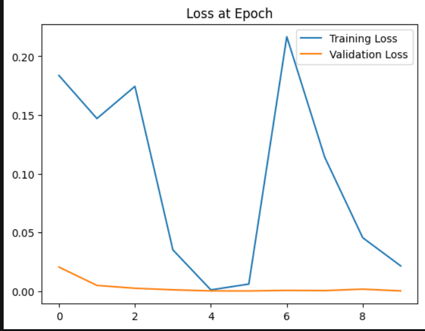
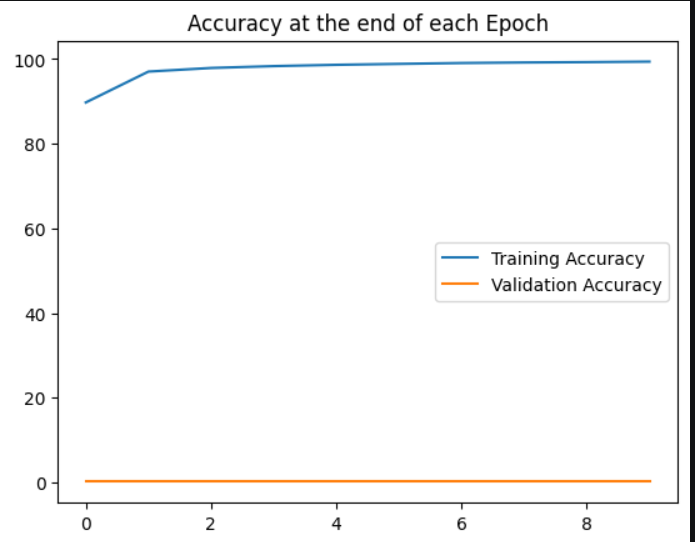
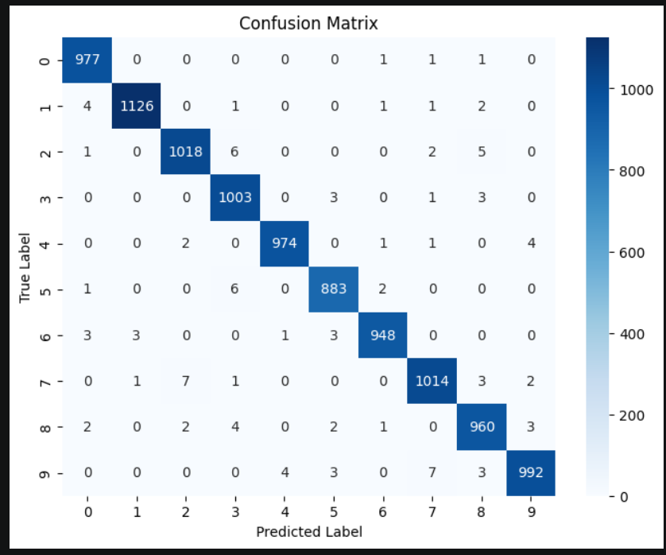

# SignVision: ASL Meets AI 

[](https://pytorch.org/)

This repository contains the final project for ** Convolutional Neural Network (CNN) - Classifying Handwritten Digits**. The objective is to build, train, and evaluate a CNN from scratch to classify digits (0-9) using the MNIST dataset.

##  Repository Structure
* `final_project.ipynb`: The main Jupyter Notebook containing data preprocessing, model architecture, training loop, and evaluation metrics.
* `outputs/`: Directory containing all generated performance plots (Loss, Accuracy, and Confusion Matrix).
* `requirements.txt`: List of Python dependencies required to run the notebook.

---

## Model Architecture
The custom CNN is built using `torch.nn` and follows the assignment's structural requirements:
* **Convolutional Layer 1**: Extracts low-level features.
* **Max Pooling Layer**: Reduces spatial dimensions.
* **ReLU Activation**: Introduces non-linearity.
* **Convolutional Layer 2**: Extracts higher-level features.
* **Max Pooling Layer**: Further dimensionality reduction.
* **Fully Connected (Dense) Layers**: 3 linear layers mapping the flattened spatial features to 10 output classes (digits 0-9).

**Hyperparameters Used:**
* **Loss Function**: Cross-Entropy Loss (`nn.CrossEntropyLoss`)
* **Optimizer**: Adam (`torch.optim.Adam`)
* **Epochs**: 10

---

## Performance & Evaluation

The model was trained for 10 epochs. Below are the visual diagnostics evaluating its performance, as required by the assignment.

### 1. Training and Test Loss vs. Epochs
*Monitors the optimization of the model and checks for convergence.*


### 2. Training and Test Accuracy vs. Epochs
*Tracks the generalization of the model to ensure it is not overfitting.*


### 3. Final Confusion Matrix
*A heatmap visualization of the model's predictions versus the true labels on the test dataset.*

---

##  Setup & Installation

To run this project locally:

1. Clone the repository:
   ```bash
   git clone [https://github.com/YOUR_USERNAME/YOUR_REPO_NAME.git](https://github.com/YOUR_USERNAME/YOUR_REPO_NAME.git)
   cd YOUR_REPO_NAME
